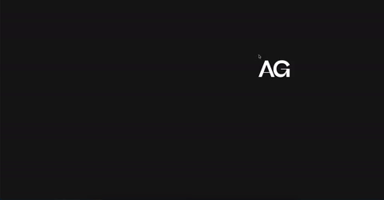

# text-trail-effect-on-mousemove

## Description

I'm testing out some new effects with the mouse cursor. This project is displaying a trail effect on mouse move with my initials. This was all done with GSAP. This can be done with images as well, not just text. Since this was just a small demonstration, I didn't include an index.js file for this project. Obviously, this is not responsive..

## Image 

## Font

The font used in this project is called 'Beatrice Display'.
